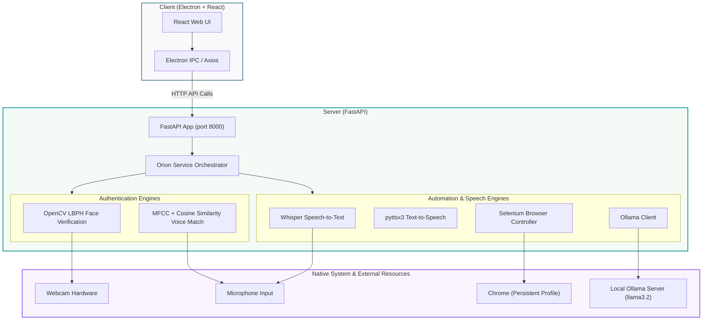

# ORION - Desktop AI Assistant

<p align="center">
  
  
  
  
  
  
</p>

ORION is a state-of-the-art, AI-powered desktop assistant that combines cutting-edge biometrics (face & voice authentication) with local large language model (LLM) reasoning and web automation. Built with a React + Electron frontend for a premium desktop experience, and a FastAPI + Python backend, ORION provides voice-controlled automation, offline and online task execution, and smart integrations like Gmail automation.

---

## 🎯 Project Overview

ORION is designed to bridge the gap between AI chat interfaces and native desktop execution. By utilizing a local LLM, ORION protects user privacy while offering natural language processing. 

### Core Capabilities:
* **🤖 AI-Powered Desktop Assistant:** A conversational assistant that understands user intent and automates system tasks.
* **🎙️ Voice Command Automation:** Hands-free execution of commands through robust speech-to-text processing.
* **👤 Face Authentication:** OpenCV-based security using local binary patterns histograms (LBPH) to prevent unauthorized access.
* **🗣️ Voice Authentication:** Biometric voice matching using Mel-Frequency Cepstral Coefficients (MFCC) and cosine similarity.
* **🌐 Offline + Online Command Execution:** Smart fallback logic that routes commands locally when offline and integrates web sources when online.
* **🕸️ Selenium Web Automation:** Automatic browser controller that performs web searches and browser tasks on behalf of the user.
* **📧 Gmail Conversational Automation:** Drafts, searches, and sends emails through conversational voice commands using persistent browser profiles.
* **💻 Electron Desktop UI:** A modern, sleek container that houses the React-based frontend.
* **⚙️ FastAPI Backend:** Asynchronous, lightweight backend server managing AI inference, speech engines, and biometrics.
* **👂 Whisper Speech Recognition:** Noise-filtered local speech recognition powered by OpenAI's Whisper model.
* **🦙 Ollama Local LLM Integration:** Local execution of models like `llama3.2` for smart parsing and prompt responses without cloud dependencies.

---

## ✨ Features

- **🔒 Face Recognition Authentication:** Secure log-in mechanism using real-time camera tracking and OpenCV LBPH Face Recognizer.
- **🎙️ Voice Authentication:** Password-free entry by validating the user's vocal characteristics (MFCCs) against their registered voiceprint.
- **💬 Voice Command Execution:** Natural speech processing allows you to control your PC by talking.
- **🖥️ Open Applications:** Native OS automation to launch desktop applications like Notepad, Calculator, etc.
- **🌐 Open Websites:** Instantly navigate to your favorite online platforms via voice.
- **🔍 Google Search Automation:** Auto-opens Chrome, performs search queries, and shows search results dynamically.
- **📺 YouTube Automation:** Searches for specific videos or playlists and starts playback automatically.
- **📧 Conversational Email Automation:** Drafts, reads, and sends emails hands-free via web automation.
- **🔑 Persistent Chrome Profile Support:** Maintains active sessions (e.g., Gmail login state) so you don't have to log in repeatedly.
- **🎙️ Noise-filtered Voice Recognition:** Pre-processes audio to minimize background sound and maximize Whisper transcription accuracy.
- **⚡ Offline + Online Hybrid Assistant:** Automatically falls back to offline pattern-matching rules if an internet connection is unavailable.

---

## 🛠️ Tech Stack

### 🎨 Frontend (Desktop Client)
| Technology | Description |
| :--- | :--- |
| **React** | Component-driven UI framework for rendering the chat and authentication screens |
| **Electron** | Desktop framework wrapping the web application to access native system APIs |
| **Vite** | Modern build tool for rapid frontend development and compilation |

### ⚙️ Backend (Python Services)
| Technology | Description |
| :--- | :--- |
| **Python** | Primary development language for backend service architecture |
| **FastAPI** | High-performance, asynchronous REST API for frontend-backend communication |
| **OpenCV** | Computer vision library used for facial capture, processing, and LBPH authentication |
| **Selenium** | Browser automation framework for Google Chrome integration and Gmail tasks |
| **Whisper** | OpenAI's automatic speech recognition (ASR) system for transcription |
| **Ollama** | Local runtime environment for running large language models (`llama3.2`) |
| **Librosa** | Audio analysis library for extraction of MFCC feature vectors for voice verification |

---

## 📐 System Architecture

ORION relies on a decoupled architecture. The React frontend runs inside an Electron shell, communicating asynchronously with the local FastAPI backend. A local Ollama instance serves the LLM endpoints, while OpenCV and Selenium interact directly with the local system resources.



### Key API Endpoints
* `POST /auth/face`: Triggers the webcam to capture frames and perform OpenCV-based verification.
* `POST /auth/voice`: Records user passphrase and compares the MFCC spectrum with registered voice models.
* `POST /voice/listen`: Starts the microphone, records spoken audio, filters noise, and transcribes using Whisper.
* `POST /command`: Takes text or transcribed commands, runs them through the local LLM (`llama3.2`), and executes the corresponding OS/Web action.

---

## 🚀 Installation & Setup

### Prerequisites
* Python 3.10 or higher installed.
* Node.js (v18+) and npm installed.
* Google Chrome installed (compatible with the local Selenium driver).
* [Ollama](https://ollama.com) installed and running locally.

### Step-by-Step Installation

1. **Clone the Repository**
   ```bash
   git clone https://github.com/kumari1022/orion-desktop-assistant.git
   cd orion-desktop-assistant
   ```

2. **Backend Setup**
   Navigate to the backend directory, create a virtual environment, and install dependencies:
   ```bash
   cd mini_project
   python -m venv venv
   
   # Activate virtual environment
   # On Windows:
   venv\Scripts\activate
   # On Linux/macOS:
   source venv/bin/activate
   
   pip install -r requirements.txt
   ```

3. **Frontend Setup**
   Navigate to the frontend directory and install the node dependencies:
   ```bash
   cd ../orion-app
   npm install
   ```

4. **Ollama LLM Setup**
   Make sure Ollama is running on your system, then pull the required Llama model:
   ```bash
   ollama pull llama3.2
   ```

---

## 🏃 Running Instructions

To run ORION locally, you need to spin up both the FastAPI backend server and the Electron-Vite frontend client.

### Step 1: Start the Backend Server
Make sure your Python virtual environment is activated in the `mini_project` directory:
```bash
cd mini_project
python -m uvicorn api_server:app --host 127.0.0.1 --port 8000 --reload
```

### Step 2: Start the Frontend Client
Open a new terminal window, navigate to the `orion-app` directory, and run the developer command:
```bash
cd orion-app
npm run dev
```

The Electron app window should open automatically and start the authentication flow.

---

## 🔄 Usage Flow

```
[Start App] ──> [Face Auth] ──> [Voice Auth] ──> [Main Chat Screen] ──> [Execute Commands]
```

1. **📷 Face Authentication:**
   On startup, ORION requests webcam access. It matches your face against the trained dataset using OpenCV LBPH.
2. **🎙️ Voice Authentication:**
   After facial verification, you will be prompted to speak your voice passphrase. The MFCC vector analysis verifies the identity.
3. **💬 Open Chat:**
   Once both biometrics verify successfully, the application unlocks the main desktop dashboard interface.
4. **🎙️ Execute Voice Commands:**
   Click the microphone button or type directly in the console to issue assistant commands.
5. **📧 Compose Emails & Automation:**
   Issue instructions like "compose email" or "search Google." ORION uses Selenium to open Chrome and complete these tasks automatically.

---

## 💬 Example Commands

Try speaking or typing the following commands to test ORION's capabilities:

| Intent | Command Example | Action Performed |
| :--- | :--- | :--- |
| **System Apps** | `"open notepad"` | Launches the Windows Notepad application |
| **Browser Navigation** | `"open youtube"` | Navigates to YouTube homepage |
| **Web Searching** | `"search google for python"` | Launches Google Chrome and searches for "python" |
| **Media Playback** | `"play songs on youtube"` | Opens YouTube, searches for popular songs, and plays the top result |
| **Email Automation** | `"compose email to someone@gmail.com"` | Opens Gmail, drafts an email to the recipient, and waits for your message |

---

## 🔮 Future Enhancements

* **💬 WhatsApp Automation:** Native API or web integrations to search contacts and send text/media messages over WhatsApp.
* **📅 Calendar Scheduling:** Syncing with Google Calendar/Outlook to schedule events and check daily agendas via voice.
* **🧠 AI Memory:** Persistent SQLite database storage enabling ORION to remember past interactions and user preferences.
* **⏰ Smart Reminders:** Background threads monitoring times and triggering desktop notifications for custom tasks.
* **🌐 Multi-language Support:** Offline translation models allowing speech recognition and output in multiple regional languages.

---

## 👥 Contributors

* **John Doe** - Lead Full Stack Developer & AI Integrations - [@github_username](https://github.com/github_username)
* **Jane Smith** - Computer Vision & Biometrics Specialist - [@github_username](https://github.com/github_username)

*Feel free to submit a pull request or open an issue to contribute to the ORION project!*

---

## 📄 License

This project is licensed under the MIT License - see the [LICENSE](LICENSE) file for details.
=======
